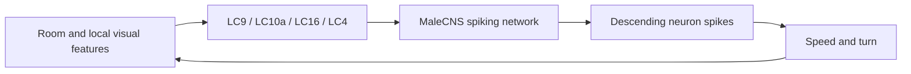

# FlyRun

**A fruit-fly connectome controlling an agent in a randomly generated room — in your browser.**

[Try the live experiment](https://flyrun.runningdog.org) · [Русское описание](README.md) · [Contributing](CONTRIBUTING.md)

FlyRun connects the spiking neural simulator from [Xenova/fruit-fly-simulation](https://huggingface.co/spaces/Xenova/fruit-fly-simulation) to a simple 2D environment. Local visual features stimulate selected neuron populations; spikes in descending neurons determine movement. The network contains **166,700 neurons and 25,582,938 directed connections** from MaleCNS v1.0.

The experiment runs locally in the browser using WebGPU, with a CPU fallback. No API key or backend inference service is needed. The interface is currently in Russian.

This is an experimental sensor-to-connectome-to-motion interface. The sensory encoding, body physics and motor readout are authored approximations. It is **not a validated simulation of a living fly**, and finding an exit is not guaranteed. The body walks in 2D; flight, muscles and learning are not implemented.

## Run locally

Use Node.js **22.13 or newer** and npm:

```sh
git clone https://github.com/huilo1/FlyRun.git
cd FlyRun
npm ci
npm run dev
```

Open the local URL printed by the server and click **«Запустить мозг»** (Start brain).

Connectome data and GPU kernels are included in this repository. The first brain load reads about **76 MB of compressed data**, verifies the graph hashes and caches it in the browser. Allow several hundred MB of memory. WebGPU requires localhost or HTTPS; simulation speed depends on your device. The time shown in the experiment is **model time**, which may advance more slowly than wall-clock time.

For a static build:

```sh
npm run build
python3 -m http.server 8000 --bind 127.0.0.1 --directory dist/client
```

Open `http://localhost:8000`. Any suitable static host can serve `dist/client` over HTTPS. See [DEPLOYMENT.md](DEPLOYMENT.md) for generic static hosting instructions. No access to the live demo's infrastructure is required.

## How it works



- **Environment:** a seeded 100 × 68 mm room with spacious passages, walls, marked hazardous surfaces and a luminous exit. Fifteen rays measure nearby objects. Exit light is local, limited by the field of view and blocked by obstacles.
- **Sensory input:** LC9 receives a symmetric artificial background; LC10a receives a visible-target signal; LC16 receives proximity and approach; LC4 receives changes in hazardous-surface proximity, with 250 ms adaptation to a constant signal. These are synthetic visual features, not a retinal model.
- **Network:** the upstream LIF model runs with a 0.1 ms neural time step. Sensory updates and motor readout occur every 10 ms of model time. Connectome weights are not trained during an experiment.
- **Motor output:** walking, turning, reverse and acceleration are decoded from DNp09/DNg100/DNg97, DNa02/DNa11/DNg13, MDN and DNp01 spikes. The decoder receives neuron activity, not a map or a desired heading. DNp01 increases ground speed here.
- **Feedback:** the resulting position changes the next sensory input. Collisions constrain translation without forcing a turn. Path search is used only to validate generated rooms; the agent is not given that path.

The default configuration keeps all **802 sensory input cells separate from the 18 motor readout cells**. The Worker checks that no motor output cell receives direct stimulation. A separate direct-DN control mode is available for comparison.

## Controls and experiments

| Interface label | Meaning | Default |
| --- | --- | --- |
| Обратная связь от среды | Feed local environmental features into the sensory adapter | On |
| Передача по связям | Enable synaptic transmission | On |
| Прямые DN-входы · контрольный режим | Directly drive motor populations as a control experiment | Off |
| Сила стимуляции | Input stimulus gain | 1.0× |
| Seed комнаты | Seed for room generation | `FLY-042` |

With direct DN inputs off, disabling synaptic transmission should make the motor response disappear after a short transient. Reset with the same room seed to compare runs from the same initial state. Disabling environmental feedback leaves the artificial LC9 background, so it does **not** measure spontaneous activity without external input.

CPU uses the room-derived neural seed; WebGPU retains the upstream fixed neural seed of 1. Numerical differences and changes made during a run can produce different trajectories. Do not expect the same path across CPU, GPU and devices.

For EXP.003, a full-graph test of `FLY-042` with neural seed 1 on both backends found the exit in **20.72 model seconds on CPU** and **31.87 model seconds in Chrome WebGPU on Apple Metal**. The longest continuous obstacle contacts were 3.67 and 3.39 seconds respectively. These are results for one tested room and configuration, not a general maze-solving benchmark.

See the [experiment notes](SENSORY_EXPERIMENT.md) (Russian), [CPU report](public/neural/sensory-validation.json) and [WebGPU report](public/neural/gpu-validation.json) for measurements and source hashes. LC16-driven retreat is weak in this model; reliable obstacle avoidance and biological fidelity remain open questions.

## Code map

| Path | Purpose |
| --- | --- |
| [`lib/world.mjs`](lib/world.mjs) | Room generation, local sensing, collision physics and motor decoding |
| [`lib/sensor-encoder.mjs`](lib/sensor-encoder.mjs) | Sensory population mapping and stimulus encoding |
| [`lib/neural/`](lib/neural/) | CPU / WebGPU simulation, graph loader and Worker protocol |
| [`app/fly-lab.tsx`](app/fly-lab.tsx) | Experiment controls and simulation loop |
| [`lib/draw-world.mjs`](lib/draw-world.mjs) | Room and neural activity rendering |
| [`public/neural/`](public/neural/) | Connectome data, kernels, provenance and validation reports |
| [`scripts/`](scripts/) | Full-graph validation tools |
| [`tests/world.test.mjs`](tests/world.test.mjs) | Geometry, sensor, decoder and regression tests |

## Validation

```sh
npm test               # lightweight geometry, sensor and neural tests
npx tsc --noEmit
npm run test:brain     # full connectome on CPU
npm run test:sensory   # sensory responses, ablations and FLY-042 contact regression
npm run test:walls     # regression for the separate direct-DN control mode
npm run build
npm run test:gpu       # compiled Worker in an isolated headless Chrome with real WebGPU
```

Full-graph checks are more expensive than the unit tests. The GPU harness uses a temporary browser profile and requires hardware WebGPU. It defaults to the macOS Chrome binary; on another installation, set `FLYRUN_CHROME` to the browser executable. It fails if the Worker falls back to CPU.

## Help explore it

Issues and pull requests are welcome in English or Russian. Useful directions include better sensory encoding, broader seeded-room evaluations, motor readout calibration, cross-device CPU/GPU comparisons and UI translation. If a fly gets stuck, report the seed, obstacle count, browser, backend, model time, toggle settings and motor activity if available.

Please read [CONTRIBUTING.md](CONTRIBUTING.md) before changing the sensor or motor interface. Keeping controls and measurements explicit makes it possible to distinguish network behavior from behavior introduced by our adapter.

## Credits and licenses

- **FlyRun code and documentation:** [MIT](LICENSE), except separately licensed upstream material and data.
- **Simulator:** [Xenova/fruit-fly-simulation](https://huggingface.co/spaces/Xenova/fruit-fly-simulation), pinned snapshot `776d115`, MIT. See the preserved [upstream license](public/neural/UPSTREAM-LICENSE) and [README](public/neural/UPSTREAM-README.md). FlyRun changes the Worker protocol and graph validation and adds the environment, sensory adapter and motor interface.
- **MaleCNS v1.0 dataset:** [source](https://male-cns.janelia.org/download/), [CC BY 4.0](https://creativecommons.org/licenses/by/4.0/). Credit: FlyEM / HHMI Janelia, University of Cambridge, MRC LMB and Google Research. The graph is redistributed in the upstream simulator's processed format, with local filename / manifest changes for static hosting; this is not a new anatomical reconstruction.
- **Model background:** [Shiu et al., Nature (2024)](https://www.nature.com/articles/s41586-024-07763-9). The original model validation does not establish validity of this MaleCNS port or the FlyRun interface.
- **Hugging Face Kernels:** Apache-2.0; preserved [third-party notices](public/neural/licenses/).

Compressed graph files end in `.gz.bin` to prevent static servers from transparently decompressing them. The loader decompresses the original gzip bytes and validates the arrays against the manifest.
